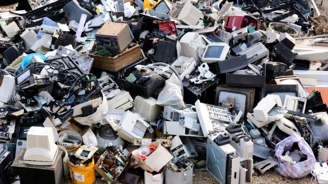

<nav class="sidebar">
<h2>ÍNDICE</h2>
<a href="index.md">Inicio</a>
<a href="contaminacion.md">Contaminación ambiental</a>
<a href="residuos.md">Residuos informáticos</a>
<a href="obsolescencia.md">Obsolescencia programada</a>
<a href="informatica-ecologica.md">Informática ecológica</a>
</nav>

<main class="contenido">

<h1>♻️ Residuos Informáticos</h1>

<section>

Los <strong>residuos informáticos</strong> son todos los dispositivos electrónicos como ordenadores, móviles, tablets o impresoras que han dejado de usarse y que necesitan ser reciclados correctamente. Su manejo adecuado es crucial para proteger el medio ambiente y la salud humana.

</section>

<section>
<h2>Problema ambiental</h2>

Muchos dispositivos contienen materiales peligrosos como plomo, mercurio, cadmio, arsénico y retardantes de llama que pueden filtrarse al suelo y al agua si se desechan incorrectamente. Además, los plásticos y microcomponentes tardan siglos en degradarse.

<ul>
<li><strong>Contaminación por metales pesados:</strong> Plomo, mercurio y cadmio presentes en componentes electrónicos contaminan el suelo y agua.</li>
<li><strong>Plásticos y retardantes de llama:</strong> Difíciles de degradar, afectan a la fauna y flora.</li>
<li><strong>Impacto energético:</strong> La producción de nuevos dispositivos requiere gran cantidad de recursos y electricidad.</li>
</ul>
</section>

<section>
<h2>Soluciones</h2>

Para reducir el impacto de los residuos electrónicos es fundamental:

<ul>
<li>Reciclar dispositivos correctamente en puntos autorizados.</li>
<li>Prolongar la vida útil mediante reparaciones o actualizaciones.</li>
<li>Optar por productos certificados como ecológicos o de bajo consumo.</li>
<li>Evitar la compra innecesaria de equipos electrónicos y fomentar la reutilización.</li>
</ul>
</section>

<section>
<h2>Consecuencias</h2>

El manejo inadecuado de los residuos informáticos provoca contaminación del aire, suelo y agua, afectando la salud de los seres humanos y la biodiversidad. La exposición prolongada a metales pesados puede causar problemas respiratorios, neurológicos y daños a órganos vitales.

Concienciarse sobre el reciclaje y la eficiencia energética es clave para proteger nuestro planeta y garantizar un futuro sostenible.

</section>

</main>
