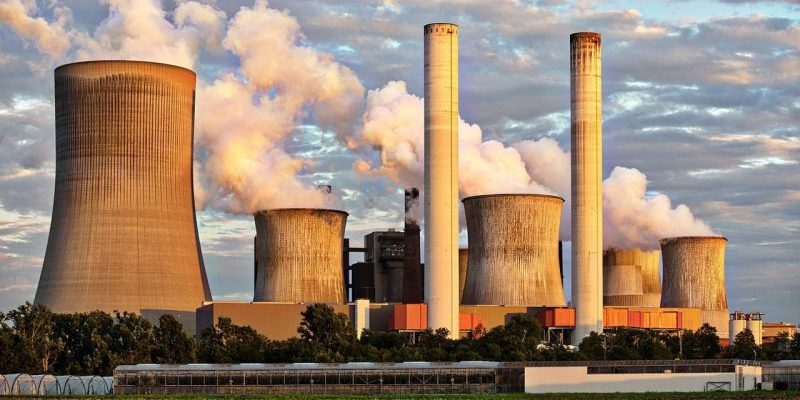

<nav class="sidebar">
<h2>ÍNDICE</h2>

- [Inicio](index.md)
- [Contaminación ambiental](contaminacion.md)
- [Residuos informáticos](residuos.md)
- [Obsolescencia programada](obsolescencia.md)
- [Informática ecológica](informatica-ecologica.md)

</nav>

<main class="contenido">

# 🌍 Contaminación Ambiental

<section>

La contaminación ambiental es la introducción de sustancias o energía que provocan efectos negativos en el medio ambiente y la salud de los seres humanos.

Este problema afecta al aire, al agua y al suelo. En gran parte es causado por las actividades humanas como las fábricas, el transporte, el uso de combustibles fósiles y la mala gestión de los residuos.

Existen distintos tipos de contaminación: atmosférica, hídrica, del suelo, lumínica y sonora, cada una con efectos específicos sobre los ecosistemas y la vida cotidiana de las personas.

</section>

<section>

## Impacto de la informática

La producción de dispositivos electrónicos requiere energía y recursos naturales, generando emisiones contaminantes. Además, los centros de datos consumen mucha electricidad para almacenar información y mantener funcionando internet.

Cuando los ordenadores, móviles o tablets dejan de usarse y no se reciclan correctamente, se convierten en residuos electrónicos que pueden contaminar el medio ambiente debido a los materiales tóxicos que contienen.

- **Contaminación por metales pesados:** Plomo, mercurio y cadmio pueden filtrarse al suelo y agua.  
- **Contaminación energética:** Alto consumo eléctrico de centros de datos.  
- **Plásticos y químicos:** Difíciles de degradar y dañinos para ecosistemas.

Para reducir este impacto, es importante reciclar los dispositivos, prolongar su vida útil y elegir productos ecológicos.

</section>

<section>

## Consecuencias

- Contaminación del aire  
- Contaminación del suelo  
- Daños en los ecosistemas  
- Impacto en la salud humana  
- Pérdida de biodiversidad  

La acumulación de residuos y la contaminación afectan a los ecosistemas naturales, provocando la desaparición de especies y problemas de salud en las personas.

Concienciarse y aplicar buenas prácticas es clave para proteger el planeta.

</section>

</main>
